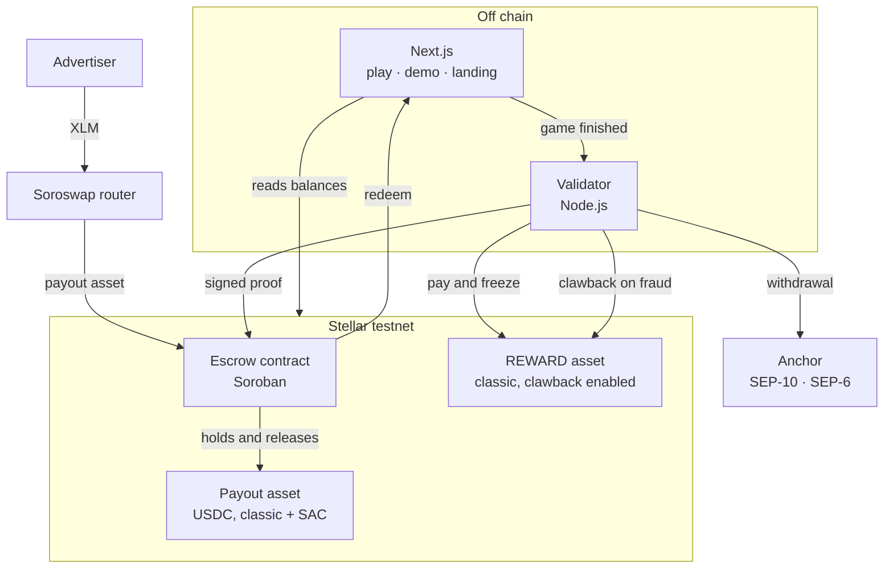

# RewardRail

A Stellar payout and settlement layer for rewarded advertising.

A player finishes a game, and money reaches three parties in seconds — with no threshold, an advertiser budget anyone can audit on chain, and a reward that can still be taken back if the play turns out to be fraud.

Built for the Rise In × Stellar Pro Hackathon 2026, Genesis Track. Testnet only.

## The problem

In rewarded advertising an advertiser pays for an install, a player earns points for completing a task, and a publisher takes a cut. The model needs micro-amount, instant, cross-border payouts. The rail underneath it is batched, delayed and separate per country, and the consequences are well known:

- Players wait for a $10–15 threshold, because a $0.40 PayPal transfer loses money on fees
- Publishers reconcile monthly and take the platform's numbers on trust
- Advertisers cannot independently verify the invoice they receive
- Fraud found after a payout is written off, because the money is gone

[Mega Fortuna](https://megafortuna.co/) runs this model across six markets, which is where the numbers in [docs/01-pitch.md](docs/01-pitch.md) come from.

## What it does

The advertiser funds a campaign in whatever asset it holds — routed to the campaign currency through Soroswap — and the budget is locked in an on-chain escrow. Every verified action releases part of it and splits it three ways. The player's share arrives as a clawback-enabled reward token, frozen for a short window, so fraud discovered after payout can still be reversed — and then converts to a balance the player withdraws to Turkish lira through an anchor.

| Claim | Mechanism | Proof |
| --- | --- | --- |
| Threshold-free micropayments | Transaction fee ~0.00001 XLM | `npm run e2e` pays 1.20 and withdraws it |
| Auditable ad spend | Soroban escrow; every release recorded on chain | Explorer links in every panel |
| Reversible rewards | Clawback (CAP-35) inside an enforced window | `npm run prove-auth-lock` runs the bypass attack and it fails |

Players never see a wallet, a seed phrase or a fee. Accounts are opened with sponsored reserves and every player transaction is fee-bumped.

## Deployed on Stellar Testnet

| Artifact | ID |
| --- | --- |
| Escrow contract | [`CD6HZHGUURVSRWZAODFFLC7JX5WCXZCXHEXOFPXAE5V5ULAD3NDCVTYI`](https://stellar.expert/explorer/testnet/contract/CD6HZHGUURVSRWZAODFFLC7JX5WCXZCXHEXOFPXAE5V5ULAD3NDCVTYI) |
| TUSDC Stellar Asset Contract | [`CDVIFB2VHPXZA74M7I7H5GFTBEK6FPC5PRNRYNZB6TVCR3MECTWY3MRB`](https://stellar.expert/explorer/testnet/contract/CDVIFB2VHPXZA74M7I7H5GFTBEK6FPC5PRNRYNZB6TVCR3MECTWY3MRB) |

Contract ids are also written to `packages/scripts/deployed.json`, which the web app reads directly so no screen can drift from the live deployment.

Reference transactions, all on testnet:

- [Clawback reclaiming a paid reward](https://stellar.expert/explorer/testnet/tx/725df28c0581a63642245e79a5c8206eaa3b5e60be650d057de80c0ccf886fe3)
- [Issuer flags set before any trustline exists](https://stellar.expert/explorer/testnet/tx/640f77b4a73be337a8187bd7fe921d0b74795076939efe3b9462d4d7693298b0)

## Screens

| Route | Who it is for |
| --- | --- |
| `/` | Landing page — the product case |
| `/play` | The player's rewards app. Two playable games, an offerwall, and a payout. Never says wallet, seed or gas |
| `/demo` | Four-panel console: advertiser, player, publisher, operator, with a shared transaction log |

## Architecture



Decisions are made off chain; value moves on chain. The chain never knows whether a player really played — that is the validator's job. What the chain does guarantee is that the budget cannot be spent without a valid proof, that share ratios cannot deviate from the campaign's table, that one action is paid at most once, and that unspent budget returns to the advertiser.

### Components

| Package | Responsibility |
| --- | --- |
| `packages/contracts` | Soroban escrow: holds budgets, verifies proofs, splits shares, handles redemption, clawback refunds and closure |
| `packages/validator` | Signs action proofs, decides risk tiers, pays and freezes rewards, drives clawback, talks to the anchor |
| `packages/web` | Landing page, player app with games, four-panel console |
| `packages/scripts` | Testnet bootstrap, asset issuance, deployment, and executable proofs of the two riskiest assumptions |

## Stellar integrations

| Feature | Where it is used |
| --- | --- |
| Soroban contracts | The escrow — conditional release, multi-party accounting |
| **Soroswap** | Funding a campaign in XLM when the escrow settles in USDC. Router contract called directly, quote read from the protocol, slippage bounded |
| Stellar Asset Contract | Lets the Soroban escrow hold a classic asset |
| Clawback (CAP-35) | Reversing a fraudulent reward after payout |
| `AUTH_REQUIRED` + `AUTH_REVOCABLE` | Freezing a reward for the clawback window, so the window is enforced by the ledger |
| Sponsored reserves | Player accounts that hold zero XLM |
| Fee-bump transactions | Players transact without ever holding XLM |
| SEP-10 | Anchor authentication — the player's own key is the identity |
| SEP-6 | Withdrawal to a Turkish bank account, USDC → TRY |
| SEP-24 | The interactive withdrawal path, for anchors that offer it |
| SEP-1 | Every anchor endpoint is discovered from `stellar.toml`, never hardcoded |

## Running it

Prerequisites: Node 20+, Rust with the `wasm32v1-none` target, and the [`stellar` CLI](https://developers.stellar.org/docs/tools/cli/stellar-cli).

```bash
npm install
```

### 1. Set up testnet accounts and assets

```bash
cd packages/scripts
npm run bootstrap       # accounts, issuer flags, and the checks that they are set
npm run issue-assets    # TUSDC, its SAC, and a funded advertiser
npm run signup          # two sponsored players, holding zero XLM
```

`bootstrap` is idempotent — rerunning reuses `keys.json` rather than orphaning a configured issuer. Secrets land in `keys.json` and `players.json`, both gitignored.

### 2. Deploy the contract

```bash
npm run deploy-escrow   # builds and deploys, writes the id to deployed.json
```

### 3. Prove the assumptions the design rests on

```bash
npm run prove-clawback    # clawback works, and fails if the issuer flags came late
npm run prove-auth-lock   # a frozen reward cannot be moved to a second account
npm run e2e               # the whole demo, end to end, with assertions
```

### 3b. Point the payout at the Turkish anchor

```bash
npm run use-anchor-asset   # trustlines, the SAC, and a campaign funded in USDC
```

The advertiser needs the payout asset first. Three ways, in order of how real they are:

| Route | Command | Notes |
| --- | --- | --- |
| Swap XLM through Soroswap | `POST /advertiser/fund {"xlm":250}` | A real swap against real testnet liquidity |
| TRY bank transfer through the anchor | `npm run fund-from-anchor` | Written and working up to the anchor's payout leg, which currently stalls |
| Circle faucet | [faucet.circle.com](https://faucet.circle.com) | 20 USDC per request, for when you just need funds |

### 4. Run the app

```bash
# terminal 1 — the ids this prints come from the setup scripts above
cd packages/validator && \
  ANCHOR_HOME_DOMAIN=tr-mock-anchor.fly.dev ANCHOR_ASSET_CODE=USDC \
  PAYOUT_ASSET_CODE=USDC PAYOUT_ASSET_ISSUER=GBBD47IF6LWK7P7MDEVSCWR7DPUWV3NY3DTQEVFL4NAT4AQH3ZLLFLA5 \
  DEMO_CAMPAIGN_ID=3 npm start

# terminal 2
cd packages/web && npm run dev
```

Open <http://localhost:3000/play> to earn, <http://localhost:3000/demo> to watch the money move.

`CLAWBACK_WINDOW_SECONDS=10` shortens the window for a live walkthrough; it defaults to 60. Every tunable is in [`.env.example`](.env.example).

### Tests

```bash
cd packages/contracts && cargo test   # 15 tests
cd packages/web && npm test           # 19 tests
```

## Key design decisions

**The player's share is a reserve, not a claim.** A claim is withdrawable by whoever owns it. A player's payout is owed against a reward token they are still holding, so letting them call `withdraw` would pay out the escrowed value while they kept the reward — the same money twice. Player balances live under a separate key and leave only through `redeem_player`, which only the platform can call and which can only pay the player it belongs to.

**`refund_clawback` takes no amount.** It refunds exactly the player's reserve. A caller-supplied figure would let the platform inflate `remaining` past what the escrow actually holds, and the first withdrawal to hit the shortfall would be the one that failed. A test asserts the invariant directly: the escrow's balance always equals `remaining` plus every open claim and reserve.

**The reward is frozen, not merely flagged.** Paying and freezing happen in one transaction. Without that, the clawback window is advisory — a player could forward the reward to a second account and convert from there, and by the time fraud surfaced the original account would be empty.

**Settlement is two transactions, on purpose.** REWARD is a classic asset whose SAC admin is its classic issuer, so minting from the contract would need an authorization entry on every settle. `settle` records the entitlement and the validator pays the reward classically. If the second transaction fails the first still stands, `action_id` is already spent so a retry cannot double-pay, and `/player/reconcile` closes the gap. The trade-off and the path to the atomic version are in [docs/02-technical-spec.md](docs/02-technical-spec.md).

**Custody is the starting state.** A rewarded-ads user is not a crypto user. Player keys are held by the backend so nobody is asked to manage a seed phrase, and a player who wants their own address can withdraw to it.

## Technical challenges

**Clawback ordering is a one-way door.** A trustline takes its clawback status from the issuer's flags at creation time, and setting the flag afterwards does not reach trustlines that already exist. Get it wrong and the reward is permanently unreclaimable. `prove-clawback.js` demonstrates both outcomes, and `bootstrap` verifies the flags before anything can trust the asset.

**Rust and JavaScript had to agree byte for byte.** The escrow verifies an ed25519 proof over `SHA256(campaign_id || player || publisher || action_id)`, and the validator signs it in JavaScript. `soroban-sdk` serializes through the value's `Val` representation, so an address is the XDR of an ScVal wrapping an ScAddress — not a bare ScAddress. Getting that wrong produces a signature that verifies nowhere and an error message that says nothing.

**Two version traps cost real time.** Testnet runs protocol 28, and `@stellar/stellar-sdk` 13 fails every Soroban call with `Bad union switch: 4` while classic calls keep working — classic XDR has not changed. And in SDK 17 `Keypair.rawPublicKey()` returns a `Uint8Array`, so `.toString('hex')` yields comma-separated decimals that the CLI rejects with a type error that never mentions encoding. Both are written up in the spec so the next person loses minutes instead of hours.

**Paying twice is one React render away.** `onComplete` in a game settles on chain and pays a reward. React runs effects and state updaters more than once under StrictMode, so an unguarded completion pays twice. Both games guard with a ref set in an event handler.

## Stellar Skills used

From [skills.stellar.org](https://skills.stellar.org):

| Skill | What it changed here |
| --- | --- |
| `skills/smart-contracts/SKILL.md` | Contract anatomy, the `wasm32v1-none` target, and the release profile |
| `skills/smart-contracts/security.md` | The escrow review that produced the reserve/claim split and the replay-guard TTL fix |
| `skills/smart-contracts/development.md` | Storage and TTL handling, authorization patterns |
| `skills/assets/SKILL.md` | Clawback, the authorization flags, and the SAC admin pattern in the roadmap below |
| `skills/standards/SKILL.md` | Choosing SEP-10 and SEP-24 for the anchor path |

## Documentation

| Document | Contents |
| --- | --- |
| [docs/01-pitch.md](docs/01-pitch.md) | Problem, solution, demo script, scope, risks, judge questions |
| [docs/02-technical-spec.md](docs/02-technical-spec.md) | Components, contract interface, proof format, setup, tests |
| [docs/03-contract-interface.md](docs/03-contract-interface.md) | The contract's surface as the web layer consumes it |
| [packages/web/components/games/README.md](packages/web/components/games/README.md) | Adding a game to the offerwall |

## The Turkish lira exit

A player finishes a game and the money reaches a Turkish bank account. That path runs end to end on testnet against the [TR Mock Anchor](https://tr-mock-anchor.fly.dev/):

```
game finished  →  1.20 USDC settled from escrow
               →  SEP-10 authentication with the player's own key
               →  SEP-6 withdrawal, rate locked at 48.54 TRY/USDC
               →  USDC sent on chain with the anchor's memo
               →  58.24 TRY paid out, status completed
```

The payout asset is Circle's testnet USDC, which is what the anchor ramps against TRY. Assets we issue ourselves proved the mechanism but have no exit — no anchor recognises them — so the demo settles in the anchor's asset instead.

Nothing in that flow is stubbed. Endpoints are discovered from the anchor's `stellar.toml`, the SEP-10 challenge is verified against the signing key it publishes, and the anchor confirms the payout itself.

## What is real and what is not

Real: the contract, the proofs, clawback, the freeze, sponsored accounts, fee-bumps, both anchor integrations, and the Soroswap route. The USDC is Circle's own testnet issuance and the swap moves real liquidity in a pool we do not own.

Not real: the bank. The anchor simulates the TRY leg — no IBAN receives money and no KYC is performed. Production means a licensed anchor, and the integration is the same code against a different home domain.

## Next steps

1. **The TRY on-ramp.** The off-ramp works; the deposit direction is written and waiting on the anchor, whose payout leg stalls at `pending_anchor`. Once it clears, a campaign budget enters as a bank transfer and the loop closes on both sides — `npm run fund-from-anchor` already runs it.
2. **Atomic settlement.** Hand the REWARD SAC admin to the escrow so `settle` mints in one transaction. This is the documented pattern and runs in production today as USDT0 — with one hard prerequisite: `set_admin` first, then lock the issuer, never the reverse.
3. **Reward-to-payout through the DEX too.** Campaign funding routes through Soroswap already; the reward conversion is still a one-to-one internal exchange because REWARD has no pool. Seeding one would let a player take their payout in any asset with liquidity.
4. **Pilot with one platform.** A single operator running real campaigns is worth more than breadth, and is the path toward SCF and InstAward.

## License

Not yet chosen.
