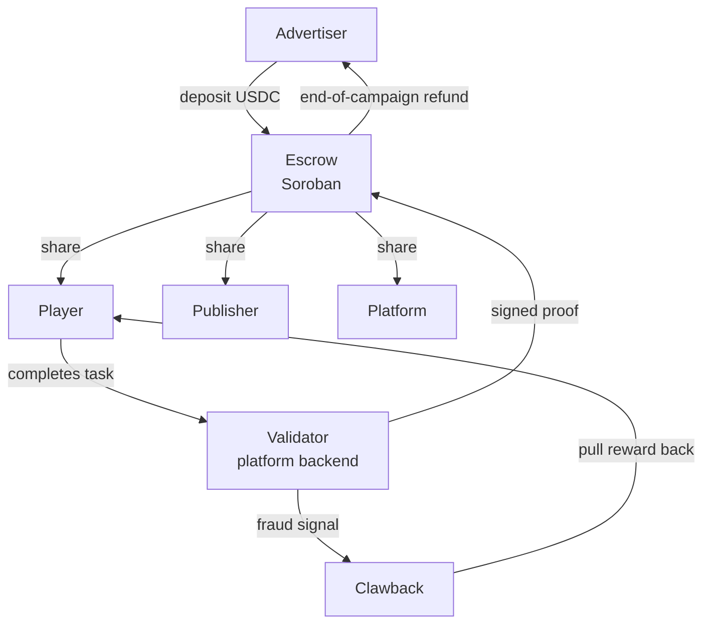

# RewardRail — Stellar Hackathon Pitch

2026-09-19

*A Stellar-based payout and settlement layer for the rewarded advertising economy*

## Summary

RewardRail moves the payout and settlement layer of rewarded advertising onto Stellar. The advertiser's budget is locked on chain, every verified user action automatically releases part of it, and the shares reach three parties within seconds.

Today this flow runs inside a closed database. Players wait for a $10–15 threshold before they can take their money, publishers are paid monthly, and advertisers cannot independently verify the invoice they receive. When fraud is detected after a payout has left, the money does not come back.

RewardRail changes three things:

1. **Threshold-free micropayments.** A Stellar transaction costs roughly 0.00001 XLM, so even a $0.03 reward can be paid out instantly.
2. **Auditable escrow.** The advertiser watches where its budget goes with its own eyes, on chain.
3. **Reversible rewards.** When fraud is found, the reward token is pulled back from the fraudulent account via clawback.

The demo shows all three live on Stellar testnet: the advertiser locks USDC in escrow, a player completes a task, the payment splits three ways, and the reward of a flagged account is clawed back. Every step is verifiable in a block explorer.

## Problem

Rewarded advertising is a working business model, but the payment rail underneath it does not match the model. The model needs micro-amount, instant, cross-border payouts; the existing rail is batched, delayed, and separate per country.

### Case study: Mega Fortuna

[Mega Fortuna](https://megafortuna.co/company/) runs this model across 6+ markets. It matches advertisers and publishers through a two-sided marketplace called [GameRewards](https://megafortuna.co/solutions/), and also operates [its own consumer apps](https://megafortuna.co/platform/): Earnimo (JP/KR), PunkteWelt (DE), JeuValeur (FR), and Richie Games (US/UK, not yet shipped).

A typical install splits like this:

| Party | Share | When they get it today |
| --- | --- | --- |
| Player | ~$1.20 | Once the threshold (e.g. $12.50) is reached |
| Publisher | ~$1.80 | After monthly reconciliation |
| Platform | ~$1.00 | Same cycle |
| **Advertiser pays** | **~$4.00** | Prepaid or invoiced |

### Four broken points

1. **Payout thresholds.** Sending a $0.40 reward over PayPal loses money on fees. So platforms impose thresholds, users wait weeks, and most abandon before ever reaching one.
2. **A separate rail per market.** Every country brings a different payment provider, a different gift card supplier, separate FX, and separate reconciliation. Entering a new market costs more in payment integration than in product.
3. **Unverifiable spend.** The advertiser has to trust the claim that "1,000 installs happened." All verification power sits with the platform; there is no independent audit path.
4. **Irreversible fraud.** Fraud is usually understood after the payout. Once money has left the account it does not come back, and either the platform or the advertiser eats the loss.

Mega Fortuna markets itself on [being fraud-resilient](https://megafortuna.co/ai/), but today that only covers pre-payout detection. Post-payout reversal is not something the existing rail offers.

## Solution: RewardRail

RewardRail is a payout and settlement layer that sits underneath rewarded advertising platforms. It does not replace the platform: campaign selection, matching, and fraud detection stay where they are. What changes is how a verified action turns into money.

The protocol has three parts:

- **Campaign escrow.** The advertiser locks the campaign budget as USDC in a contract. The budget is at neither the platform's nor the advertiser's free disposal.
- **Reward token (REWARD).** The points a player earns are issued as a clawback-enabled Stellar asset. A point is no longer a database row but a balance with a known owner.
- **Distribution.** Every verified action opens the escrow, and the shares go to player, publisher, and platform in the same transaction.

### What changes for each actor

| Actor | Today | With RewardRail |
| --- | --- | --- |
| Player | Waits for a $12.50 threshold, has to set up a wallet | No threshold, the reward lands in seconds; the platform sponsors the account, no XLM needed |
| Publisher | Monthly reconciliation, trusts the platform's numbers | The share accrues in escrow on every action and is withdrawn on demand; the balance is visible on chain |
| Advertiser | Trusts the invoice, cannot audit spend | Budget is locked, every release is recorded on chain, unspent budget is returned |
| Platform | Must catch fraud before paying out | Can claw the reward back within the window |

### The key design decision: the player knows nothing about crypto

The player sets up no wallet, sees no seed phrase, buys no XLM. The platform opens the account with a sponsored reserve and pays the transaction fee via fee-bump. The player only ever sees a balance and a "withdraw" button.

This is the precondition for adoption. A rewarded-ads user is not a crypto user, and any flow that asks for wallet setup loses them at step one.

## Why Stellar

Every part of this problem set maps one-to-one onto a Stellar protocol feature. The choice is not about fit, it is about necessity.

| Problem | Stellar feature | Why it is hard elsewhere |
| --- | --- | --- |
| Payout threshold | Transaction fee ~0.00001 XLM | A fee has to stay below a $0.03 reward; on most chains the fee exceeds the reward itself |
| Post-payout reversal | Clawback (CAP-35), at protocol level | Most chains need a custodial wallet or bespoke contract logic to reverse |
| Player wallet setup | Sponsored reserves + fee-bump | The user does not need to acquire a token before opening an account |
| Multi-market cash-out | USDC + the SEP-24 anchor network | Local-currency exit through one standard interface, no per-market integration |
| Closed point systems | Path payments + the built-in DEX | Brand points → USDC in one transaction, without building separate liquidity |
| Budget escrow | Soroban contract | Conditional release and return of unspent budget |

### Why clawback is central to this project

Clawback lets an issuer pull back an asset it issued from an account. The asset is explicitly flagged at issuance, so the user knows from the start what they accepted.

For a general-purpose financial token this counts as a flaw. For an advertising reward it is the opposite: a reward is already a conditional promise, and it needs to be reversible when the condition is violated. This is the technical answer to fraud, the industry's most expensive problem.

### An honest limit

Real fiat cash-out needs an anchor, and that cannot be set up to production standard within a hackathon. The demo shows the exit through a testnet anchor or a simulated SEP-24 flow, and says so openly.

## Architecture and money flow

Verification is the only piece that stays off chain. Campaign selection, matching, and fraud scoring remain the platform's job; the chain only carries and proves the outcome.

The validator holds a signing key the escrow recognizes. The escrow only pays out when it sees an action proof signed with that key.

### Step by step

1. **Campaign opening.** The advertiser sets the budget and the per-action amount, then deposits USDC into the escrow. Share ratios are written into the contract as a per-publisher table: a player / publisher / platform triple for each publisher. The advertiser sees the whole table up front, and the table is locked for the life of the campaign.
2. **Player account.** When the player signs up, the platform opens their account with a sponsored reserve and creates a trustline for the REWARD asset. The player never needs XLM.
3. **Action.** The player completes the task. The platform runs its own fraud checks.
4. **Proof.** The validator signs a proof containing the campaign and player identity and submits it to the escrow. The same action cannot be paid twice.
5. **Distribution.** The escrow splits the shares in a single transaction. The player's share arrives as REWARD; the publisher and platform shares accrue as claims inside the escrow.
6. **Cash-out.** The player converts REWARD to USDC and exits to local currency through an anchor. There is no threshold; trusted accounts convert instantly, new accounts wait until the window closes.
7. **Fraud.** If fraud is found within the window, the issuer claws the REWARD back from that account and the amount returns to the escrow to be redistributed within the same campaign. Once the window closes, the authority lapses.
8. **Closing.** At the end of the campaign, unspent budget is returned to the advertiser.

### Why the reward is not USDC directly

If the player were handed USDC directly, clawback would be impossible, because the platform is not the issuer of USDC. Using REWARD as an intermediate layer confines the reversal authority to the reward's own lifecycle. The moment the player converts REWARD to USDC the link is cut and the money is entirely theirs.

This is the design decision that balances the fraud window against user ownership, and it should be stated plainly to the judges.

### The clawback window and tiers

The reversal authority is neither unlimited in time nor applied to everyone. Because fraud concentrates in new accounts, the window is set by risk.

| Tier | REWARD → USDC conversion | Clawback window |
| --- | --- | --- |
| Trusted account (7+ days, 5+ tasks) | Instant | None |
| New account | After the window | 24 hours |
| Account carrying suspicious signals | After the window | 24 hours, extendable by an operator |

This tiering reconciles two claims. Instant payout stays genuinely true for the large majority of users, while fraud protection operates where the risk concentrates. The demo shortens the window to 60 seconds.

### Why the publisher share is pulled, not pushed

The publisher share is not sent automatically on every action. It accrues as a claim in the escrow and the publisher withdraws it in a single transaction whenever they choose.

Automatic sending produces a separate payment per action and fragments the publisher's bookkeeping. The pull model lets publishers pick their own reconciliation timing and reduces transaction count. Because the balance is visible on chain, waiting costs no trust. There is no minimum withdrawal; the no-threshold principle applies on the publisher side just as it does for players.

## Demo script

The demo is four panels side by side on one screen: advertiser, player, publisher, operator. The player panel holds two accounts, one honest and one fraudulent. After each step the resulting transaction hash appears on screen and opens in Stellar Expert.

| Minute | Step | On screen | Proof |
| --- | --- | --- | --- |
| 0:00 | Framing the problem | The $12.50 threshold screen and a monthly reconciliation table | — |
| 0:40 | Campaign opening | Advertiser locks 100 USDC, the publisher ratio table appears | Escrow balance in the explorer |
| 1:10 | Player signup | Two players sign in by email, no wallet setup | Sponsored accounts created |
| 1:40 | Task completion | Both players finish the task, each is credited $0.40 | Shares split in one transaction |
| 2:10 | Instant withdrawal | The trusted player withdraws $0.40 | No threshold, fee ~0.00001 XLM |
| 2:40 | Publisher withdrawal | The publisher claims the accrued share | Transfer from escrow to publisher |
| 3:10 | Fraud scenario | The operator flags the second player | Clawback; the honest player's money is untouched |
| 3:40 | Campaign closing | Unspent budget returns to the advertiser | Refund transaction in the explorer |

### The spine of the narrative

The one line for the judges: *"In the same four minutes you saw three things — threshold-free micropayments, an auditable ad budget, and a reward that can be reversed after payout. None of the three is possible on the existing payment rail."*

The two-player setup is deliberate: clawback only works on a reward that has not yet been converted, so the honest player who withdrew first stays untouched. That demonstrates fraud protection and user protection at the same time. Each demo step is ordered to answer one likely objection. Threshold-free withdrawal answers the fee question, clawback answers "why a chain," and the escrow refund answers "why would an advertiser adopt this."

### Preparation notes

- Run the transactions on testnet once beforehand and keep the hashes. If the network slows down, show the backup hashes.
- Keep explorer tabs open in advance; searching live wastes time.
- The word "wallet," "seed," or "gas" must not appear anywhere in the player panel. That is the visual proof of the design claim.

## Hackathon scope

Scope was drawn by a single rule: nothing that will not be shown in the demo gets built. A hackathon project loses by sprawling, not by being incomplete.

### In scope

- Escrow contract: deposit, share splitting against a signed proof, publisher withdrawal, refund at campaign close
- Issuing the clawback-enabled REWARD asset, trustline setup, and the tier-based conversion lock
- Sponsored account creation and a fee-free player experience via fee-bump
- REWARD → USDC conversion
- A four-panel web interface: advertiser, player, publisher, operator
- Validator service: a small backend that signs task-completion proofs

### Out of scope

| Excluded | Reason |
| --- | --- |
| A real mobile SDK | Adds nothing visually to the demo, high integration cost |
| A real fraud model | Manual flagging in the operator panel shows the same thing |
| Fiat cash-out via a production anchor | Legal and integration time do not fit a hackathon |
| AI matching / allocation | The platform's job, not the protocol's |
| Multi-campaign management | One campaign demonstrates the whole mechanism |
| Mainnet deployment | Testnet is sufficient and safer for a demo |

### Definition of success

The project succeeds if a stranger, using the interface, can verify all three claims on chain within four minutes. Lines of code and feature count are not the measure.

## Technical stack and plan

### Soroban or classic

Both. The escrow's conditional logic needs Soroban; the reward asset, clawback, trustlines, and sponsorship are far faster to build with Stellar classic operations.

| Piece | Layer | Reason |
| --- | --- | --- |
| Escrow, share splitting, refund | Soroban | Conditional, multi-party logic |
| REWARD issuance and clawback | Classic | Built into the protocol, no contract needed |
| Sponsored accounts, fee-bump | Classic | Built into the protocol |
| REWARD → USDC | Classic path payment | The built-in DEX is enough |

If time runs short, the escrow can move to classic as well: a multisig account plus claimable balances tells the same story. That is the plan's fallback route.

### Stack

- **Chain:** Stellar testnet, Soroban
- **Contract:** Rust
- **Backend:** Node.js, Stellar SDK; the validator service that signs proofs
- **Frontend:** Next.js, four panels on one page
- **Explorer:** Stellar Expert testnet links

### Hour-by-hour plan

| Block | Work | Output |
| --- | --- | --- |
| 0–4 | REWARD issuance, a clawback trial, sponsored accounts | Core operations working on chain |
| 4–10 | Escrow contract and its tests | Deposit, distribution, refund all work |
| 10–14 | Validator service and the signing flow | One end-to-end flow runs from the terminal |
| 14–22 | Four-panel interface | A clickable demo |
| 22–26 | Fraud panel and the clawback flow | The second claim becomes visible |
| 26–30 | Rehearsal, backup hashes, presentation | A timed narrative |

If the end-to-end flow does not run from the terminal by hour 14, that is the decision point for moving the escrow to the classic fallback. Postponing that decision is the biggest risk.

## Impact and business case

### Comparison

The left column represents common industry practice; read it as an order of magnitude, not an exact figure.

| Measure | Existing rail | RewardRail |
| --- | --- | --- |
| Smallest payable amount | ~$10–15 (threshold) | ~$0.01 |
| Player wait time | Days or weeks | Seconds |
| Publisher reconciliation | Monthly | Per action |
| Advertiser oversight | Platform report | Independent verification on chain |
| Entering a new market | A new payment integration | The existing anchor network |
| Post-payout fraud | Written off as loss | Reversed via clawback |

### Who adopts it and why

**The platform.** Removing the threshold does not raise reward cost; the balance of a user who never reaches the threshold is a liability anyway. The gain is in retention and in a simpler payout operation.

**The advertiser.** Auditable spend answers the single biggest objection to the rewarded channel. Automatic return of unspent budget also makes prepayment acceptable.

**The player.** Instant, threshold-free payout directly solves this category's most common complaint.

**The Stellar ecosystem.** Rewarded advertising is a textbook case of low-value, high-frequency cross-border payments. Users entering the network without knowing anything about crypto is a real distribution channel for the network.

### After the hackathon

Running a pilot with a single platform comes before turning the protocol into a general product. An operator like Mega Fortuna — multi-market and mid-transition — is the narrowest and most realistic first counterpart.

## Risks and judge questions

### Risks

| Risk | Impact | Response |
| --- | --- | --- |
| The Soroban escrow is not ready in time | The demo is incomplete | Switch to the classic fallback at hour 14 |
| Testnet slows down during the demo | The presentation stalls | Pre-generated backup hashes |
| Clawback reads as "user hostile" | Draws objections | It applies only to the reward token and only within the window; never to trusted users |
| No anchor integration | Fiat exit cannot be shown | State up front that it is out of scope |
| The validator stays centralized | "Not decentralized enough" | A deliberate design choice; see the answer below |

### Likely judge questions

**"Why can't you do this without a blockchain?"**
Threshold-free micropayments are impossible on the existing rail because of fees. Independent verification of advertiser spend is impossible inside a closed database. And post-payout reversal does not exist on bank rails outside of chargebacks.

**"The validator is centralized, so the trust problem isn't solved."**
True, but the problem moves. Today the platform both makes the decision and holds the money. In RewardRail the decision stays with the platform while the money sits in an escrow no single party can move. The validator's signature is permanent on chain, so a wrong decision can be audited after the fact.

**"Users don't want crypto."**
They won't see any. Wallets, seed phrases, and transaction fees appear nowhere in the interface. The demo shows this live.

**"With clawback, is it really the user's money?"**
No, and that is intentional. A reward token is a conditional promise; today it is just as reversible inside the platform's database, only without a record. Once the window closes, or once the user converts to USDC, the money is entirely theirs. Trusted users never face the window at all.

**"Why Stellar, wouldn't another chain do?"**
Clawback at the protocol level, sponsored reserves that let a user open an account without holding a token, and a transaction fee below the reward amount do not exist together anywhere else.

### Decisions

- **Trust threshold.** An account becomes trusted once it passes 7 days of age and 5 completed tasks. Either criterion alone is easy to game, so both are required.
- **Clawed-back rewards.** The amount pulled back returns to the escrow and is redistributed within the same campaign.
- **Publisher withdrawal.** No minimum. The no-threshold principle is the project's core claim, so no threshold is imposed on the publisher side either.
- **Ratio table.** Locked for the life of the campaign. A party wanting different ratios opens a new campaign.

### Open questions

- Which testnet anchor will the demo use, or will fiat exit be simulated?
- Does a campaign close when its time runs out, or when its budget is exhausted?

Implementation detail, contract interface, and setup steps: [Technical Specification](./02-technical-spec.md)
