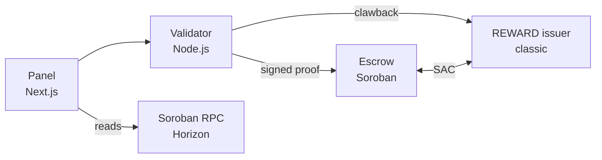

# Technical Specification

*RewardRail implementation detail — Stellar testnet*

## System components

The system has four parts. The dividing principle: decisions are made off chain, value transfer happens on chain.

| Component | Where | Responsibility |
| --- | --- | --- |
| Escrow contract | Soroban, testnet | Holds the budget, splits shares, handles withdrawals and refunds |
| REWARD asset | Stellar classic | Reward balance, clawback authority |
| Validator service | Node.js backend | Signs task-completion proofs, decides the risk tier |
| Panel interface | Next.js | Screens for the four actors, surfaces transaction hashes |

### Responsibility boundary

What the chain does not know: whether the player actually played, whether the account is fraudulent, which offer to show to whom. All of that is the validator's job.

What the chain guarantees: that the budget cannot be spent without authorization, that share ratios cannot deviate from what the contract says, that the same action cannot be paid twice, and that unspent budget returns to the advertiser.

This distinction matters because the project's claim is not "the chain solves fraud." The claim is: whoever makes the fraud decision, the movement of money stays auditable and reversible.



## Assets and accounts

### Assets

| Asset | Type | Role |
| --- | --- | --- |
| `REWARD` | Classic asset we issue | The player's reward balance, clawback enabled |
| `TUSDC` | Test stablecoin we issue | The value held in escrow, standing in for USDC in the demo |
| `XLM` | Native | Only fees and reserves; the user never sees it |

Issuing our own test asset instead of real USDC is a deliberate choice. The testnet USDC issuer address and faucet availability are an external dependency, and it is not worth the risk of it failing mid-presentation. Architecturally there is no difference, since both are standard classic assets.

### Accounts

| Account | Flags | Notes |
| --- | --- | --- |
| REWARD issuer | `AUTH_REQUIRED`, `AUTH_REVOCABLE`, `AUTH_CLAWBACK_ENABLED` | Clawback needs the last two, and the flag must precede every trustline. `AUTH_REQUIRED` makes a new trustline start unauthorized |
| TUSDC issuer | None | Plain issuer, no clawback needed |
| Sponsor / fee payer | None | Sponsors player accounts, signs fee-bumps |
| Validator | None | Only signs proofs, holds no funds |
| Advertiser | None | Holds TUSDC, deposits into escrow |
| Publisher | None | Receives TUSDC |
| Player (x2) | None | Sponsored, holds a REWARD trustline |

### Critical ordering

The clawback flag must be set **before any trustline is created**. When a trustline is created it is marked clawback-enabled according to the issuer's flags at that moment. Setting the flag afterwards does not cover existing trustlines.

This is the easiest mistake to make during setup, and it surfaces as "clawback isn't working" at demo time. The setup script must set the flags in the first step and verify them.

## Escrow contract

A single contract carries all campaigns. Deploying one contract per campaign is unnecessary complexity.

### Data structures

```rust
pub struct Split {
    pub player_bps: u32,     // basis points, 10000 = 100%
    pub publisher_bps: u32,
    pub platform_bps: u32,
}

pub struct Campaign {
    pub advertiser: Address,
    pub token: Address,          // the SAC address of TUSDC
    pub validator: BytesN<32>,   // ed25519 public key
    pub per_action: i128,        // total paid per action
    pub remaining: i128,
    pub splits: Map<Address, Split>,  // publisher -> ratio
    pub open: bool,
}
```

The `splits` map is how the per-publisher ratio decision is represented. It cannot be changed after the campaign opens; there is no function in the contract that updates this map.

### Functions

| Function | Caller | What it does |
| --- | --- | --- |
| `open_campaign` | Advertiser | Transfers the budget, registers the campaign |
| `settle` | Validator | Verifies the proof, splits shares, pays the player |
| `withdraw` | Publisher / platform | Withdraws the accrued claim |
| `refund_clawback` | Issuer admin | Returns a clawed-back reward to the campaign |
| `close_campaign` | Advertiser | Closes the campaign, refunds the remainder |

```rust
pub fn settle(
    env: Env,
    campaign_id: u64,
    player: Address,
    publisher: Address,
    action_id: BytesN<32>,
    signature: BytesN<64>,
) -> Result<(), Error>;
```

`settle` does the following in order: checks whether `action_id` has been used before, verifies the signature against the campaign's `validator` key, checks that `remaining` is sufficient, records all three shares as claims, and marks `action_id` as spent.

### The player's reward is a separate transaction

`settle` does not mint REWARD. It records the player's entitlement, and the validator immediately follows it with a classic payment from the REWARD issuer to the player.

The reason is an ownership constraint. REWARD is a classic asset, so the admin of its Stellar Asset Contract is the classic issuer account. For the escrow to mint it, the issuer would have to sign a Soroban authorization entry attached to every `settle` call. That is possible — the validator already holds the issuer key — but authorization entries are fiddly to assemble and hard to diagnose when they fail, which is a poor trade inside a hackathon.

The cost of the split is that a payout is two transactions rather than one, and in principle `settle` can land while the reward payment fails. The validator retries, and because `action_id` is already marked spent the retry cannot double-pay. Both transactions are visible in the explorer, so nothing is lost in auditability.

In production the atomic version is the right design, and moving to it does not change any other part of the system.

### Other design notes

- **The escrow holds TUSDC, the player holds REWARD.** The TUSDC backing a player's reward stays in escrow as reserve and is paid out when the player converts.
- **The publisher share is pull, not push.** `settle` only increments a balance, it does not transfer. The transfer happens on a `withdraw` call.
- **`action_id` is the heart of replay protection.** Even if the validator submits the same proof twice, the second one is rejected.
- **Basis points, not decimals.** The three shares must sum to exactly 10000; `open_campaign` verifies this.

## Validator and proof format

The validator is the only authority the escrow recognizes. It holds no funds, it only signs. Stealing its key cannot drain the escrow, because payouts can only follow the ratios written in the contract and only in the `per_action` amount.

### The signed message

```
message = SHA256(
    campaign_id (u64, big-endian)
  || player      (32 bytes)
  || publisher   (32 bytes)
  || action_id   (32 bytes)
)
signature = Ed25519-Sign(validator_secret, message)
```

`action_id` is the hash of a unique action identifier in the validator's own event log. The same player completing a second task in the same campaign produces a different `action_id`, so legitimate repeat payouts are not blocked.

### Why this format

The message binds campaign, player, publisher, and action together. If any one of the four changes, the signature is invalid. A stolen proof cannot be moved to another player or another campaign.

The amount is not part of the message. The contract derives it from `per_action` and `splits` itself. That way the validator cannot alter the amount even if it wanted to.

### Alignment point: the risk tier

The validator also decides which tier a player is in. This is not written on chain; the conversion lock is enforced off chain. The reason: the tier rule is a frequently changing business rule, and embedding it in the contract would require a redeployment on every change.

This is a deliberate trade-off. The lock is not enforced on chain, which means the platform could technically delay a player's conversion unfairly. In exchange, the clawback window and the ratios are enforced on chain.

### API endpoints

| Endpoint | Method | Purpose |
| --- | --- | --- |
| `/action/complete` | POST | Records the task, signs the proof, calls `settle` |
| `/player/tier` | GET | Returns the player's tier and remaining window |
| `/player/convert` | POST | Runs the REWARD → TUSDC conversion if the tier allows |
| `/fraud/flag` | POST | Flags an account, triggers the clawback and refund chain |
| `/player/reconcile` | POST | Pays a reward that `settle` recorded but whose payment failed |

## Clawback and risk tiers

### The clawback chain

When the operator flags an account, three transactions run in order:

1. The issuer account pulls the player's REWARD balance back with a `CLAWBACK` operation.
2. The reclaimed REWARD is burned; the matching TUSDC was already sitting in escrow.
3. A `refund_clawback` call increases the campaign's `remaining`, and `action_id` stays marked as spent.

The third step is where the decision shows: the reclaimed amount is not refunded to the advertiser, it is redistributed within the same campaign.

### Window and tiers

Tiers are stored in the validator's database.

| Tier | Condition | Conversion | Window |
| --- | --- | --- | --- |
| Trusted | Account age 7+ days **and** 5+ completed tasks | Instant | None |
| New | One of the two not met | After the window | 24 hours |
| Suspicious | Flagged by an operator | After the window | 24 hours, extendable |

In the demo the window is 60 seconds. The value is read from configuration, not hardcoded.

### The payout comes out of escrow

Converting does two things: the player's REWARD is sent back to its issuer and burned, then the escrow pays the matching TUSDC out of the claim recorded at settle time. Nothing is minted, and the money the advertiser locked is the money the player receives.

The withdrawal is made by the player, not on their behalf. `withdraw` calls `require_auth()` on the claim holder, and Soroban treats the transaction's source account as implicitly authorized — so the player signing the transaction satisfies it, with no authorization entry to assemble. The sponsor then fee-bumps the whole transaction, which is what lets an account holding zero XLM withdraw its own money.

Order matters: the reward is burned first. If the withdrawal then fails, the claim is still on chain and a retry completes it. Withdrawing first would leave a window in which the player holds both the payout and a still-clawbackable reward.

### How the lock is enforced

The ledger enforces it, not the service.

A reward is paid and frozen in the same transaction: the issuer authorizes the trustline, sends the reward, and revokes authorization again, all as three operations of one submission. The player sees the balance and cannot move it. There is no moment in between where the reward is both received and transferable.

Freezing needs `AUTH_REVOCABLE` on the issuer, and `AUTH_REQUIRED` means a new trustline starts unauthorized — so REWARD cannot be received by any account we never authorized. Both are set at bootstrap, verified before anything trusts the asset.

Without this the window would be advisory. A player could forward the reward to a second account and convert from there, and by the time fraud surfaced the original account would be empty. `npm run prove-auth-lock` runs exactly that attack on testnet: the transfer is rejected with `op_src_not_authorized`, the second account receives nothing, and clawback still reaches the frozen reward.

Conversion thaws the trustline, burns the reward and freezes it again, in one transaction. If the burn fails, the trustline never unfreezes.

`/player/convert` still checks the tier before any of this. That check is the off-chain half and can be stalled by the platform; the freeze is the on-chain half and cannot be circumvented by the player. The two guard different parties.

## Sponsored accounts and the fee-free player flow

A single transaction handles everything at player signup. It is assembled and paid for by the sponsor.

### The signup transaction

```
FeeBumpTransaction (fee: sponsor)
  └─ Transaction (source: sponsor)
       1. BEGIN_SPONSORING_FUTURE_RESERVES  (sponsored: player)
       2. CREATE_ACCOUNT                    (player, starting 0 XLM)
       3. CHANGE_TRUST                      (REWARD, source: player)
       4. CHANGE_TRUST                      (TUSDC,  source: player)
       5. END_SPONSORING_FUTURE_RESERVES    (source: player)
```

Signatures: sponsor **and** player. Because the player's key is generated in the backend at signup, the backend provides the second signature too. The player signs nothing.

Result: the player account has a zero XLM balance, its reserves are paid by the sponsor, and two trustlines are ready.

### Key custody

The player's secret key is stored encrypted in the backend. This is a custodial model and it is intentional.

The reasoning: the target audience is ordinary players using a rewards app. Handing them seed phrase responsibility produces nothing but user loss in this segment. A user who wants to can withdraw to their own address; custody is the starting state, not a cage.

In the hackathon demo, keys are held in memory or in a simple file. Production requires a KMS; this should be said openly.

### Who pays fees

Every transaction the player triggers is wrapped in a fee-bump paid by the sponsor account. Since the player account holds no XLM, it could not submit a transaction any other way.

| Transaction | Fee paid by | Notes |
| --- | --- | --- |
| Signup | Sponsor | Reserves are also on the sponsor |
| Receiving a reward | Platform | The platform submits the `settle` call |
| REWARD → TUSDC | Sponsor | Fee-bump |
| Clawback | Issuer | No player approval required |

## Interface panels

Four panels sit side by side on one page. Switching pages breaks the demo flow and scatters the judges' attention.

| Panel | Shows | Actions |
| --- | --- | --- |
| Advertiser | Escrow balance, ratio table, spent / remaining | Open campaign, close campaign |
| Player (two accounts) | REWARD balance, tier, remaining window | Complete task, convert to TUSDC |
| Publisher | Accrued claim | Withdraw |
| Operator | Player list and risk signals | Flag as fraudulent |

### Transaction proof must be visible

After every action a shortened transaction hash appears at the bottom of the panel, linking to Stellar Expert. This is the visual counterpart of the project's "auditable" claim. If the hash is not visible, the claim is just words.

A shared transaction log sits at the bottom of the page: time, action, actor, hash. By the end of the demo the whole flow is visible in one list.

### State management

Panels read from the chain and keep no local state. Relevant balances are refetched after every action.

This is slow but honest. Keeping local state with optimistic updates invites the question "is this actually happening on chain?" during the demo. Balances coming from the chain are the claim itself.

### Consistency in language

These words never appear in the interface: wallet, seed, private key, gas, transaction fee, blockchain. The player panel must look like a rewards app.

Technical language is fine in the operator and advertiser panels; those parties already see the infrastructure.

## Setup, testing, and the fallback route

### Network and tooling

| Piece | Value |
| --- | --- |
| Network | Stellar testnet |
| Account funding | Friendbot |
| Classic access | Horizon testnet |
| Contract access | Soroban RPC testnet |
| CLI | `stellar` (formerly `soroban`) |
| Contract language | Rust, `soroban-sdk` 28 |
| Backend | Node.js, `@stellar/stellar-sdk` **17 or newer** |

Two version traps cost time, so they are recorded here rather than rediscovered.

Testnet runs protocol 28, and an older SDK cannot parse its Soroban XDR. On `@stellar/stellar-sdk` 13 every contract call failed with `Bad union switch: 4` while classic operations kept working, because classic XDR has not changed. The error points at nothing useful; the cause is the version.

In SDK 17 `Keypair.rawPublicKey()` and `Keypair.sign()` return `Uint8Array` rather than `Buffer`. Calling `.toString('hex')` on one yields comma-separated decimals, which the CLI rejects with a type error that does not mention encoding. Wrap them in `Buffer.from()`.

For a Soroban contract to hold a classic asset, that asset's Stellar Asset Contract must be deployed. For TUSDC this step is part of the setup script.

### Setup order

1. Generate accounts and fund them with friendbot
2. Set issuer flags: `AUTH_REVOCABLE` + `AUTH_CLAWBACK_ENABLED`
3. Read back and verify that the flags are set
4. Deploy the SAC for TUSDC
5. Create advertiser and publisher trustlines, mint TUSDC to the advertiser
6. Build and deploy the escrow contract
7. Generate the validator keypair

Step 3 must not be skipped. A flag-ordering mistake only surfaces when clawback is attempted, and at that point everything has to be rebuilt from scratch.

### Test plan

| Test | Expected |
| --- | --- |
| Same `action_id` twice | The second is rejected |
| Proof signed with the wrong key | Rejected |
| Payout larger than the remaining budget | Rejected |
| Shares not summing to 10000 | `open_campaign` rejects it |
| `remaining` after clawback | Increases by the reclaimed amount |
| `settle` after closing | Rejected |
| Early conversion on a new account | Rejected |
| Transaction from a sponsored account with 0 XLM | Passes via fee-bump |

### The classic fallback route

If the Soroban escrow is not running end to end by hour 14, the plan changes. The fallback:

- A 2-of-3 multisig classic account instead of the escrow: advertiser and validator sign together
- Share distribution as three `PAYMENT` operations in one transaction
- `CLAIMABLE_BALANCE` for publisher withdrawal, claimed whenever the publisher wants
- Campaign refund as a manually signed payment

What is lost: `action_id` replay protection and ratio enforcement move off chain to the validator. What is kept: clawback, sponsored accounts, threshold-free payouts, and auditable money movement — meaning all three of the main claims still stand.

The existence of this fallback is the project's single biggest risk reducer. If the decision point is postponed, there will be no time to build the fallback either.

## Anchor integration

The exit to real money runs through the SDF reference anchor on testnet. It is integrated, not mocked.

| Step | Protocol | What happens |
| --- | --- | --- |
| Discovery | stellar.toml | Endpoints and the anchor's signing key are read from `https://<home domain>/.well-known/stellar.toml`, never hardcoded |
| Authentication | SEP-10 | The anchor issues a challenge transaction; the player's custodial key signs it and exchanges it for a session token |
| Withdrawal | SEP-24 | A withdrawal is opened on the anchor's server and returns its own interactive URL for KYC and payout details |
| Status | SEP-24 | `GET /transaction?id=` reports the anchor's view: `incomplete`, then `pending_user_transfer_start`, and onward |

The challenge's source account is checked against the `SIGNING_KEY` in the toml before it is signed. Skipping that check would let any server that answers on the right URL harvest signatures from player accounts.

### Endpoints

| Endpoint | Purpose |
| --- | --- |
| `GET /anchor` | The resolved toml plus the withdraw limits for the configured asset |
| `POST /player/cashout` | Authenticates and opens a withdrawal; returns the anchor's transaction id and interactive URL |
| `GET /player/cashout/:id` | The anchor's status for that withdrawal |

### What is real and what is not

Real: the authentication, the withdrawal record, the anchor's limits, the status transitions, and the fact that payout details go to the anchor rather than to us.

Not real: the money. The anchor is a test deployment, its asset is SRT rather than a production stablecoin, and it accepts 1–10 SRT per withdrawal. Production means a licensed anchor per market — the same protocol against a different counterparty.

## Funding a campaign through Soroswap

The escrow settles in one asset, because share ratios and reserves have to be denominated in something. An advertiser holds whatever it holds. Left alone that mismatch becomes the advertiser's problem: acquire the exact asset first, then come back and open a campaign.

Routing through [Soroswap](https://soroswap.finance) removes the step. The advertiser funds in XLM and the escrow receives the payout currency, at a price the router quotes and the advertiser sees before anything moves.

### Why the router contract rather than the aggregator API

Soroswap publishes an aggregator API that routes across several protocols. It is mainnet-only — its own health endpoint reports no indexed protocols on testnet — and it requires a key. The router contract is deployed on testnet and needs neither, so that is what we call.

| Piece | Address |
| --- | --- |
| Router | `CCJUD55AG6W5HAI5LRVNKAE5WDP5XGZBUDS5WNTIVDU7O264UZZE7BRD` |
| Factory | `CDP3HMUH6SMS3S7NPGNDJLULCOXXEPSHY4JKUKMBNQMATHDHWXRRJTBY` |
| XLM/USDC pair | `CCBX3NZTCQLQFSPG7HBOKL4P2RVPOPVFHDNRTOSCCJWBTPL2GHEH7RQS` |

The pair already existed with real depth, so the demo trades against liquidity nobody on this team provided.

### Endpoints

| Endpoint | Purpose |
| --- | --- |
| `GET /advertiser/quote?xlm=250` | What the router would give, before anyone commits |
| `POST /advertiser/fund` | Executes the swap and reports what was quoted, what was accepted and what arrived |

### Two things the code is careful about

**The price comes from the router, not from us.** A price derived from pool reserves is a guess about the protocol's own maths. `router_get_amounts_out` returns the number it will honour.

**`amount_out_min` is the whole protection.** Without it a swap executes at whatever the pool offers by the time it lands, which on a thin pool is whatever an observer decides to make it. The quote is taken, one percent of slippage is allowed, and anything worse reverts. A ten minute deadline bounds the other direction: long enough to survive a busy network, short enough that a stale quote cannot execute at a price nobody agreed to.
